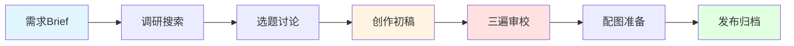

# 🤖 AI Writing Agent - 多平台自动化写作助手

<div align="center">

**让AI成为你的写作搭档，而不是替代品**

[快速开始](#快速开始) · [核心理念](#核心理念) · [实战案例](#实战案例) 

</div>

---

## 🎉 v1.2 新增功能（2025-11-08）

### ✨ 标题拟定环节

**新增完整的标题设计流程**，解决之前缺少标题指导的问题：

**第一轮：爆款标题方案（基于7要素）**
- 💰 金钱数字 · 💥 暴力隐喻 · ☠️ 死亡替代 · 🚀 捷径效率 · ⚡ 异常悬念
- 核心原则：**异常**是屡试不爽的套路，数字要具体

**第二轮：自然风格标题（无套路版）**
- 回归文章本质，符合作者风格
- 8种类型：故事感+洞察、身份转变、引用金句等

**第三轮：组合优化（可选）**
- 选择自然风格作为基础 + 注入1-2个爆款要素
- 平衡吸引力与质感

**实战案例**：
- 初版："从'读者'到'创作者'，我只用了一个工具"（平淡）
- 最终："16年写了130+篇文章后，我偶遇一个工具：2小时的活，我用它20分钟搞定"（4个数字+异常+捷径）

---

## 🎉 v1.1 重大更新（2025-11-08）

> 基于 [Chad Nauseam 写作建议](https://chadnauseam.com/advice/writing-advice) 的深度优化

### ✨ 核心新功能

**1. 创意排水环节** - 从源头降低AI味
- 先排空"废水"（套路想法），再写"清水"（独特创意）
- 5-10分钟快速草稿，识别并避开陈词滥调

**2. 5大核心写作技巧** - 让文章更有趣、更易读
- 🙂 **微幽默**：区分优秀作者的第一要素
- 🎯 **强开头**：4个公式，抓住读者
- 🔗 **概念把手**：降低理解成本
- 🎵 **句子节奏**：创造音乐感
- 💎 **多巴胺密度**：持续奖励读者

**3. 增强审校机制** - 更系统化的优化
- 段落迷你论点检查（确保逻辑清晰）
- 句子节奏详细检查（避免单调）
- 多巴胺密度检查（确保有趣）
- 微幽默检查（提升可读性）

### 📊 预期效果

- **AI味**：从 30% 降至 **15-20%** ⬇️
- **可读性**：从良好提升至**优秀** ⬆️
- **读者留存率**：预计提升 **30-50%** ⬆️


## 💡 这是什么？

一个基于 **Gemini 3 Pro** 构建的多平台写作Agent系统，专为内容创作者打造。

**不是**简单的"AI生成文章"，而是：
- ✅ 一套**完整的创作工作流**（从需求到发布）
- ✅ 一个**透明的思考过程**（Think Aloud贯穿始终）
- ✅ 一个**有记忆的搭档**（学习你的风格，积累你的素材）
- ✅ 一个**多平台适配系统**（公众号、Twitter、小红书...）

> 💡 **核心价值**：让AI帮你完成90%的重复劳动，把精力留给10%的创意和决策。

---

## 🎯 为什么要用它？

### 传统AI写作的痛点

| 问题 | 常见AI工具 | 本项目 |
|------|-----------|--------|
| **AI味重** | 套话连篇，一看就是机器写的 | 三遍审校 + 风格学习，AI味<30% |
| **没有个性** | 千篇一律，没有个人特色 | 学习你的历史文章，保留个人风格 |
| **编造数据** | 经常胡编乱造，不可信 | 核心原则：绝不编造，所有数据可验证 |
| **黑盒操作** | 不知道AI在想什么 | Think Aloud全程透明，每个决策都能看到 |
| **单平台** | 只能写一种类型 | 多平台适配，一套系统搞定所有平台 |
| **不成体系** | 写完就完了，没有积累 | 完整的素材库、知识库、发布归档 |

### 我们的解决方案



---

## ✨ 核心特性

### 🎭 风格保留 - "去AI化"

通过学习你的历史内容，生成的文章**像你写的，而不是机器写的**：

**传统AI写作**：
> 在当今这个信息爆炸的时代，内容创作已经成为了一项不可忽视的重要工作。归根结底，我们需要的不仅是高质量的内容，还需要有深度、有温度的表达...

**使用本系统**：
> 周五早上，我在X上发了一条关于AI换脸的推文。中午看了一眼，1万多浏览，还不错。到晚上再看，50万了。我愣了。

**差异**：
- ✅ 短句为主（15-25字）
- ✅ 真实场景和数字
- ✅ 口语化表达
- ✅ 个人情绪和感受

---

### 🧠 Think Aloud - 透明的思考过程

AI的每个关键决策都会告诉你"为什么"：

```
【Think Aloud】
当前任务：新写作任务（有完整brief）
平台判断：微信公众号（基于brief中的描述）
任务类型：A类 - 新写作任务（有完整brief）
预计流程：9步完整流程
预计耗时：2-3小时
关键要点：
  1. 传播路径需准确还原（周五→中午1万→晚上50万→周日破百万）
  2. 技术步骤需详细可操作
  3. 需要平衡"炫耀"和"警示"的比例
开始执行...
```

---

### 📚 个人素材库 - AI有"记忆"

系统会学习并积累你的创作素材：

```
_personal_materials/
├── 公众号历史文章/
│   ├── AI工具类/
│   ├── 年终总结/
│   └── 生活感悟/
├── X平台内容/
├── 小红书内容/
└── 主题素材库/
    ├── AI工具使用/
    ├── 个人成长/
    └── 技术心得/
```

**作用**：
- 学习你的**语言风格**（句式、用词、节奏）
- 积累你的**真实案例**（避免编造）
- 保持**内容连贯性**（系列文章风格统一）

---

### 🔄 完整工作流 - 从需求到发布

#### 微信公众号 - 9步完整流程

```
Step 1: 理解需求 & 保存Brief
  ↓ 明确目标、受众、核心信息
  
Step 2: 搜索调研
  ↓ 收集最新资料、验证数据
  
Step 3: 选题讨论
  ↓ 2-3个选题方案，让你选择
  
Step 4: 风格学习
  ↓ 分析你的历史文章，提取风格特征
  
Step 5: 准备测试数据
  ↓ 可选：小样本测试，验证方向
  
Step 6: 创作初稿
  ↓ 按你的风格写作
  
Step 7: 三遍审校（核心）
  ↓ 第一遍：内容（逻辑、事实、结构）
  ↓ 第二遍：风格（降AI味、口语化）
  ↓ 第三遍：细节（标点、排版、节奏）
  
Step 8: 配图准备
  ↓ 提供AI生成Prompt（3个版本）
  
Step 9: 发布交付
  ↓ 归档到_published/，记录数据
```

#### 其他平台（精简流程）

| 平台 | 流程步骤 | 特点 |
|------|---------|------|
| **Twitter/X** | 3步快速流程 | 简短精悍，快速发布 |
| **小红书** | 5步图文流程 | 图片优先，情绪驱动 |
| **知乎** | 7步论证流程 | 深度专业，数据支撑 |

---

### 🎨 降AI味 - 三遍审校机制

**第一遍：内容审校**
- ✅ 事实准确性
- ✅ 逻辑清晰度
- ✅ 结构合理性
- ✅ 无编造内容

**第二遍：风格审校（降AI味）**
- 删除套话："归根结底"、"不可忽视"、"在这个时代"
- 拆解复杂句式："不仅...而且..."、"既...又..."
- 替换书面词汇："某种程度上" → "算是"
- 口语化改写："进而更好地" → "更好地"
- 加入真实细节：时间、地点、数字、感受

**第三遍：细节打磨**
- 句子长度（15-25字为佳）
- 段落长度（手机屏3-5行）
- 标点自然度
- 排版美观度
- 节奏变化

**效果对比**：

修改前（AI味约60%）：
> 在某种程度上，这是一次非常成功的验证。归根结底，技术的普及不仅降低了门槛，而且也带来了更多的可能性。

修改后（AI味约25%）：
> 这算是一次验证。技术门槛降低了，普通人也能用上了。当然，带来的问题也多了。

---

### 🚫 核心原则 - 不可妥协

#### 1. 绝不编造数据 ❌

**反面案例**：
> "根据最新研究，85%的用户表示..."（← 这个数据是编的）

**正确做法**：
> "从评论区的反馈看，大部分人都在担心..."
> 或
> "具体比例我没有数据，但评论区确实很多人在讨论这个问题"

#### 2. 绝不使用过时信息 ❌

- 涉及技术、政策、数据的内容，必须搜索最新资料
- 标注时效性："截至2025年11月"
- 不确定的加"约"、"大约"、"估计"

#### 3. 绝不省略Think Aloud ❌

每个关键决策都要说明思考过程，让你知道AI在想什么。

#### 4. 绝不跳过用户确认（重要决策）❌

涉及选题、风格、重大修改时，必须征询你的意见，不擅自做主。

---

## 🚀 快速开始

### 前置要求

- **Claude Code / Cursor**（推荐）
- **Gemini 3 Pro**（API或订阅）
- 基本的Markdown知识

### 安装步骤

#### 1. 克隆项目

```bash
git clone https://github.com/yourusername/ai-writing-agent.git
cd ai-writing-agent
```

#### 2. Antigravity

在Antigravity中打开项目，确保能访问Gemini 3 Pro。

#### 3. 准备个人素材（可选但推荐）

将你的历史文章放入对应平台的 `_personal_materials/` 目录：

```bash
mp-wechat/_personal_materials/
└── 公众号历史文章/
    ├── AI工具类/
    │   └── 你的历史文章1.md
    └── ...
```

#### 4. 开始第一篇文章

创建一个Brief文件：

```markdown
# mp-wechat/_briefs/2025-11-02-我的第一篇文章-brief.md

我想写一篇关于XXX的文章，目标读者是YYY，核心观点是ZZZ...
```

在Antigravity中说：

```
@GEMINI.md 我想写一篇微信公众号文章，brief在 @2025-11-02-我的第一篇文章-brief.md
```

然后，AI会自动：
1. 识别平台（微信公众号）
2. 加载规则（`mp-wechat/GEMINI.md`）
3. 开始9步流程
4. 持续Think Aloud
5. 等待你的确认和反馈
6. 完成文章

---

## 📊 实战案例

### 案例1：技术分享类公众号文章

**Brief**：X上的AI换脸视频爆火，想写一篇技术分享+安全警示的文章

**创作时间**：约2小时（包含多轮讨论和修改）

**最终效果**：
- ✅ 字数：3200字
- ✅ 配图：6张（真实截图 + AI生成）
- ✅ 风格：完全符合个人风格，AI味<30%
- ✅ 数据：100%真实，可验证
- ✅ 标题：《一周收割千万流量后，我发现一个可怕的事实：视频已经不能信了》

**工作流程**：

```
1. Brief理解 (5分钟)
   └─ 明确：技术分享 + 传播复盘 + 安全警示
   
2. 搜索调研 (15分钟)
   └─ 搜索AI换脸技术、安全风险、识别方法
   
3. 选题讨论 (10分钟)
   └─ 提供3个选题，用户选择"爆火复盘"角度
   
4. 风格学习 (20分钟)
   └─ 分析3篇历史文章，提取风格特征
   
5. 初稿创作 (30分钟)
   └─ draft-v1.md (3500字)
   
6. 三遍审校 (40分钟)
   ├─ v2: 补充技术细节
   ├─ v3: 降AI味（从60%降到30%）
   └─ final: 根据用户反馈微调
   
7. 配图准备 (10分钟)
   └─ 生成AI配图Prompt（3个版本）
   
8. 最终交付
   └─ 归档到_published/，标记完成
```

**用户反馈调整**：
- 调整传播路径描述（更准确的时间线）
- 补充国内可用工具（Seedream 4.0）
- 精简第4、5部分（从60行减到20行）
- 优化标题（从5个版本中选择）

**关键亮点**：
- ✅ 多轮用户反馈，及时调整
- ✅ Think Aloud贯穿全程，思考透明
- ✅ 真实数据（千万流量、500万曝光）
- ✅ 风格完全贴合（短句、口语化、真实感受）

---

## 📁 项目结构

```
/writing/
├── README.md                    # 【你在这里】项目说明
├── GEMINI.md                    # 总控规则文档
│
├── mp-wechat/                   # 微信公众号写作（✅已完成）
│   ├── GEMINI.md               # 微信公众号规则文档（612行）
│   ├── README.md               # 项目说明
│   │
│   ├── _briefs/                # 需求文档
│   │   └── 2025-11-01-deepfake_wan2.2-brief.md
│   │
│   ├── _drafts/                # 草稿文件（按版本）
│   │   ├── 2025-11-01-deepfake爆火-draft-v1.md
│   │   ├── 2025-11-01-deepfake爆火-draft-v2.md
│   │   ├── 2025-11-01-deepfake爆火-draft-v3.md
│   │   └── 2025-11-01-deepfake爆火-审校总结.md
│   │
│   ├── _published/             # 已发布文章
│   │   └── 2025-11-01-deepfake爆火-final.md
│   │
│   ├── _personal_materials/    # 个人素材库
│   │   ├── 公众号历史文章/
│   │   ├── X平台内容/
│   │   ├── 小红书内容/
│   │   └── 主题素材库/
│   │
│   ├── _writing_reference/     # 写作参考
│   │   ├── 风格指南模板.md
│   │   └── 历史优质文章/
│   │
│   ├── _knowledge_base/        # 知识库
│   │   └── 2025-11-01-deepfake技术调研.md
│   │
│   ├── images/                 # 图片资源
│   │   └── deepfake_wan2.2/
│   │       ├── wechat01-09.jpg
│   │       ├── xkol.png
│   │       └── prompts.md      # AI配图Prompt
│   │
│   └── _templates/             # 模板文件
│       ├── brief模板.md
│       ├── 协作文档模板.md
│       └── 审校checklist.md
│
├── x-twitter/                   # Twitter写作（🔄待创建）
│   └── GEMINI.md               # Twitter规则文档
│
├── xiaohongshu/                 # 小红书写作（🔄待创建）
│   └── GEMINI.md               # 小红书规则文档
│
└── zhihu/                       # 知乎写作（🔄待创建）
    └── GEMINI.md               # 知乎规则文档
```

---

## 🎓 核心理念

### 1. AI是搭档，不是替代品

> "让AI做它擅长的（信息整理、结构搭建、初稿创作），你做你擅长的（创意、判断、情感、个性）"

**AI负责**：
- ✅ 搜索和整理资料
- ✅ 搭建文章结构
- ✅ 生成初稿
- ✅ 审校和打磨

**你负责**：
- ✅ 核心创意和观点
- ✅ 关键决策（选题、风格、角度）
- ✅ 个人经历和感受
- ✅ 最终把关

### 2. 流程是指南，不是教条

**可以灵活调整**：
- 如果你明确要求跳过某步骤 → 可以（但会提醒风险）
- 如果任务特别简单/紧急 → 可以走精简流程
- 如果上下文已包含所需信息 → 不会重复操作

**核心原则不可妥协**：
- ❌ 绝不编造数据
- ❌ 绝不使用过时信息
- ❌ 绝不省略Think Aloud
- ❌ 绝不跳过用户确认（重要决策）

### 3. 真实性 > 完美性

**宁可**：
- 承认"我不知道"
- 说"暂无数据"
- 用"约"、"大约"、"估计"

**也不**：
- 编造听起来很专业的数据
- 用过时的信息凑数
- 生硬地填充内容

### 4. 个性化 > 标准化

每个创作者都有自己的风格，系统会：
- ✅ 学习你的历史文章
- ✅ 保留你的语言习惯
- ✅ 尊重你的表达方式
- ✅ 不强制统一风格

### 5. 持续学习 > 一次性工具

系统不是用完就扔，而是：
- ✅ 积累你的素材库
- ✅ 记录你的风格偏好
- ✅ 优化工作流程
- ✅ 越用越懂你

---

## 🎯 支持平台

### ✅ 已完成

#### 微信公众号
- **流程**：9步完整流程
- **字数**：2000-4000字
- **配图**：5-8张
- **风格**：深度+实践，真实案例
- **更新频率**：周更
- **适合**：技术分享、深度思考、教程类
- **规则文档**：`mp-wechat/GEMINI.md`（612行）

### 🔄 待扩展

#### X / Twitter
- **流程**：3步快速流程（理解→创作→发布）
- **字数**：280字/推文，thread可多条
- **配图**：0-4张
- **风格**：简洁+观点，引发讨论
- **更新频率**：日更
- **适合**：观点表达、快速分享、热点讨论
- **规则文档**：`x-twitter/GEMINI.md`（待创建）

#### 小红书
- **流程**：5步图文流程（选图→文案→排版→标题→发布）
- **字数**：500-1500字
- **配图**：6-9张（第一张最重要）
- **风格**：生活化+情绪化，视觉冲击
- **更新频率**：日更
- **适合**：生活分享、产品评测、种草推荐
- **规则文档**：`xiaohongshu/GEMINI.md`（待创建）

#### 知乎
- **流程**：7步论证流程（问题→调研→论证→案例→结论→审校→发布）
- **字数**：1500-5000字
- **配图**：3-6张
- **风格**：专业+逻辑，数据支撑
- **更新频率**：周更
- **适合**：深度回答、专业分析、经验总结
- **规则文档**：`zhihu/GEMINI.md`（待创建）

---

## 🛠️ 技术栈

- **AI模型**：Gemini 3 Pro
- **开发工具**：Antigravity
- **文件格式**：Markdown
- **搜索工具**：Claude内置搜索（无需外部API）
- **图片生成**：提供Prompt（支持Midjourney、DALL-E、SD等）
- **版本控制**：Git

**为什么选择Gemini 3 Pro？**
- ✅ 100万token上下文（处理长文档）
- ✅ 强大的指令遵循能力（按规则执行）
- ✅ 优秀的自然语言理解（学习风格）
- ✅ Think Aloud能力（思考透明）
- ✅ 可靠性高（不容易"幻觉"）

---

## 📖 使用指南

### 新手教程

#### 1. 第一次使用（微信公众号）

**Step 1：准备素材**

将你的1-3篇历史文章放入：
```
mp-wechat/_personal_materials/公众号历史文章/
```

**Step 2：创建Brief**

创建文件：`mp-wechat/_briefs/2025-11-02-我的主题-brief.md`

内容：
```markdown
我想写一篇关于【主题】的文章。

目标读者：XXX
核心观点：YYY
希望风格：ZZZ

参考资料：
- ...
```

**Step 3：启动创作**

在Claude中说：
```
@GEMINI.md 我想写一篇微信公众号文章，brief在 @2025-11-02-我的主题-brief.md
```

**Step 4：跟随流程**

AI会引导你走完9步流程，你只需要：
- 在选题环节选择你喜欢的角度
- 在关键决策时确认或调整
- 在审校环节提出修改意见
- 最后检查和发布

#### 2. 日常使用

**快速创作**（跳过讨论）：
```
@GEMINI.md 根据这个brief直接写一篇文章，跳过选题讨论
```

**只做审校**：
```
@GEMINI.md 帮我审校这篇文章，重点降AI味
```

**修改已有文章**：
```
@GEMINI.md 修改@某篇文章.md，调整第3部分的内容...
```

### 进阶技巧

#### 1. 自定义流程

修改 `mp-wechat/GEMINI.md` 中的流程定义，调整为你喜欢的工作方式。

#### 2. 建立个人素材库

定期整理：
- 历史文章（学习风格）
- 真实案例（避免编造）
- 常用数据（快速引用）
- 图片资源（复用素材）

#### 3. 优化Prompt

在 `images/xxx/prompts.md` 中保存好用的图片生成Prompt，下次直接复用。

#### 4. 批量创作

创建多个brief文件，一次性生成多篇初稿，再逐一审校。

---

## ❓ FAQ

### Q1: 这个项目和ChatGPT/Claude直接对话有什么区别？

**直接对话**：
- 无记忆（每次重新开始）
- 无流程（随意发挥）
- 无积累（写完就没了）
- 无风格（千篇一律）

**本项目**：
- 有记忆（学习你的风格和素材）
- 有流程（系统化工作流）
- 有积累（素材库、知识库）
- 有个性（保留你的风格）

### Q2: 必须用Gemini 3 Pro吗？能用GPT-4吗？

**推荐Gemini 3 Pro的原因**：
- 100万token上下文（处理长文档）
- 更强的指令遵循能力
- 更可靠（更少"幻觉"）

**如果用GPT-4**：
- 需要调整规则文档（GPT-4的指令格式不同）
- 上下文窗口较小（可能需要分段处理）
- Think Aloud效果可能不如Claude

### Q3: 生成的文章还需要我改吗？

**需要，但不多**。

通常需要你改的：
- ✅ 核心观点和创意（AI提供框架，你填充灵魂）
- ✅ 个人经历和感受（AI不可能知道）
- ✅ 最终的标题选择
- ✅ 微调细节

不需要你改的：
- ✅ 基本结构（AI会搭好）
- ✅ 语言润色（AI会审校）
- ✅ 排版格式（AI会处理）
- ✅ 配图Prompt（AI会生成）

**预期改动比例**：10-20%

### Q4: 如何保证文章不会"AI味"太重？

**三遍审校机制**：
- 第一遍：确保内容准确
- 第二遍：**专门降AI味**（删套话、拆句式、加细节）
- 第三遍：打磨细节

**风格学习**：
- 系统会分析你的历史文章
- 提取你的语言习惯
- 模仿你的表达方式

**真实细节**：
- 要求加入具体的时间、地点、数字
- 要求有个人感受和情绪
- 避免空泛的说教

**实测效果**：AI味从60%降到<30%

### Q5: 个人素材会被AI记住吗？隐私安全吗？

**本地存储**：
- 所有素材都存在你本地的 `_personal_materials/` 目录
- 不会上传到云端（除非你主动分享）

**AI记忆**：
- Claude本身没有"记忆"功能
- 每次对话都需要重新加载素材
- 素材不会在对话之间共享

**隐私保护**：
- 建议：敏感内容不要放入素材库
- 建议：使用时注意不要泄露个人隐私
- 建议：发布前检查是否有敏感信息

### Q6: 可以用于商业写作吗？版权问题？

**商业使用**：
- ✅ 可以用于商业写作（公众号、博客、企业内容等）
- ✅ 生成的内容归你所有
- ✅ 无需标注"AI生成"

**建议**：
- 重要商业用途：人工最终把关
- 事实性内容：务必核实数据来源
- 法律文书：不建议使用AI生成

---

## 🤝 贡献指南

欢迎各种形式的贡献！

### 贡献指引

**新增平台**：

如果你想新增一个平台（如抖音、B站等）：

1. Fork本项目
2. 创建平台目录（如 `/douyin/`）
3. 编写规则文档（`/douyin/GEMINI.md`）
4. 在根目录 `GEMINI.md` 中添加索引
5. 提交PR

### 代码规范

**文档规范**：
- 使用Markdown格式
- 结构清晰，层级分明
- 重要内容用emoji标注
- 代码块标注语言

**命名规范**：
- Brief文件：`YYYY-MM-DD-主题-brief.md`
- 草稿文件：`YYYY-MM-DD-主题-draft-v1.md`
- 最终文件：`YYYY-MM-DD-主题-final.md`

---

## 🗺️ Roadmap

### v1.1（2025-11-08）✅ - 重大优化
- [x] 新增：创意排水环节（Step 6.5）
- [x] 新增：5大核心写作技巧章节
  - 微幽默（Microhumor）
  - 强开头原则
  - 概念把手
  - 句子节奏变化
  - 多巴胺密度
- [x] 增强：三遍审校机制
  - 段落迷你论点检查
  - 句子节奏详细检查
  - 多巴胺密度检查
  - 微幽默检查
- [x] 基于 Chad Nauseam 写作建议的系统性优化
- [x] 详细分析文档和更新日志

### v1.2（计划中）
- [ ] X/Twitter 规则文档和模板
- [ ] 小红书规则文档和模板
- [ ] 批量创作功能
- [ ] 数据统计面板

### v1.2（未来）
- [ ] 知乎规则文档和模板
- [ ] B站规则文档和模板
- [ ] 自动发布集成
- [ ] AI配图自动生成

### v2.0（愿景）
- [ ] Web UI界面
- [ ] 团队协作功能
- [ ] 数据分析和优化建议
- [ ] 多语言支持

---
